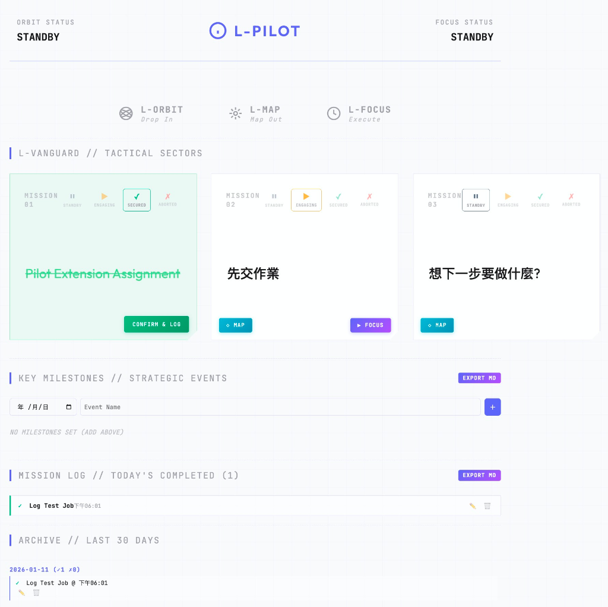

# L-PILOT | L.EGION 指揮中心

> [!TIP]
> ### 🚀 快速下載測試
> **[👉 點此下載最新版本 ZIP 檔 👈](https://github.com/digirss/l-pilot-extension/releases/latest/download/L-PILOT.zip)**  
> (下載後解壓縮，即可按照下方說明快速安裝)

> **你的每日任務中樞。** 一款 Chrome 擴充功能，將你的生產力工具整合為一個強大的儀表板。



---

## ✨ 功能特色

L-PILOT 將瀏覽器的新分頁變成你的個人指揮中心：

- **🎯 任務追蹤**：設定最多 3 個每日目標，並追蹤狀態（待命 → 執行中 → 已完成/已放棄）。
- **⏱️ 專注連動**：與 [L-FOCUS](https://1pxai.1pa.uk/l-focus/) 計時器無縫整合。完成專注任務後，任務自動標記為 SECURED。
- **🪐 軌道同步**：從 [L-ORBIT](https://1pxai.1pa.uk/l-orbit/) 抓取你的年度進度與里程碑，顯示在指揮中心。
- **🗺️ 快速繪圖**：一鍵啟動 [L-MAP](https://1pxai.1pa.uk/l-map/)，將想法展開為結構化心智圖。
- **📜 任務日誌**：自動封存已完成的任務並記錄時間戳，隨時可匯出為 Markdown。

---

## 🚀 安裝方式

### 方法一：開發者模式載入（推薦）

1. 下載或 Clone 此儲存庫。
2. 開啟 Chrome，前往 `chrome://extensions/`。
3. 開啟右上角的 **開發者模式**。
4. 點擊 **載入解壓縮擴充功能**，選取 `l-pilot` 資料夾。
5. 開啟新分頁 — 歡迎來到你的指揮中心！

---

## 🔗 連動服務

L-PILOT 與 L.EGION 生產力套件完美搭配：

| 服務 | 網址 | 說明 |
| :--- | :--- | :--- |
| **L-FOCUS** | [1pxai.1pa.uk/l-focus](https://1pxai.1pa.uk/l-focus/) | 番茄鐘風格的專注計時器，內建環境音效。 |
| **L-ORBIT** | [1pxai.1pa.uk/l-orbit](https://1pxai.1pa.uk/l-orbit/) | 年度目標追蹤器，視覺化里程碑。 |
| **L-MAP** | [1pxai.1pa.uk/l-map](https://1pxai.1pa.uk/l-map/) | 從文字大綱即時產生心智圖。 |

---

## 🛡️ 隱私與安全

**你的資料只屬於你。**

- ✅ 所有資料都儲存在你的瀏覽器本機（`chrome.storage.local`）。
- ✅ 沒有外部伺服器、沒有分析追蹤、沒有任何資料上傳。
- ✅ 擴充功能只會讀取 L.EGION 網頁上的公開 HTML 元素，無法修改或存取任何私人資料。
- ✅ 完全開源：你可以在此儲存庫中審查每一行程式碼。

### 權限說明

| 權限 | 用途說明 |
| :--- | :--- |
| `storage` | 用於在本機儲存你的任務、歷史紀錄與同步的里程碑。 |
| `host_permissions` | 用於在 L.EGION 網頁上執行內容腳本以進行資料同步。 |

### 安全性檢查

| 檢查項目 | 狀態 | 說明 |
| :--- | :--- | :--- |
| **API Key / 密碼** | ✅ 無 | 程式碼中沒有任何敏感憑證。 |
| **外部資料上傳** | ✅ 無 | 沒有任何 `fetch` 或 API 呼叫至外部伺服器。 |
| **網頁修改能力** | ✅ 無 | 只讀取 DOM，不會修改您的網站內容。 |
| **使用者隱私** | ✅ 保障 | 所有資料都存在使用者自己的電腦裡。 |

---

## 📁 專案結構

```
l-pilot/
├── manifest.json       # 擴充功能設定檔
├── newtab.html         # 新分頁儀表板介面
├── styles.css          # 儀表板樣式
├── script.js           # 核心邏輯（任務、歷史、同步）
├── background.js       # Service Worker（訊息處理）
├── content.js          # 從 L-ORBIT 網頁抓取資料
├── content-focus.js    # 監聽 L-FOCUS 的任務完成事件
└── src/
    └── icons/          # 擴充功能圖示（16、48、128px）
```

---

## 🤝 貢獻

歡迎貢獻！請隨時開啟 Issue 或提交 Pull Request。

---

## 📄 授權

MIT License © 2026 [1PxAi](https://1pxai.1pa.uk/)

---

<p align="center">
  <b>在無路之處，開闢道路。</b><br>
  <a href="https://1pxai.1pa.uk/">1PxAi 總部</a>
</p>
